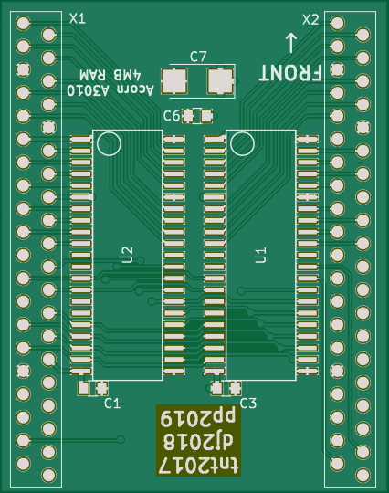
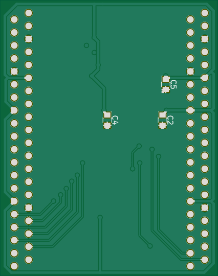

# A3010 RAM board

Originally by Tim Tashpulatov (tnt23), later updated by Daniel Jameson (drdpj).

This branch is based on Daniel's last 2-layer version, and contains tweaks by Phillip Pearson (myelin).

[Stardot thread](https://stardot.org.uk/forums/viewtopic.php?f=16&t=11214)

Pictures
--------

